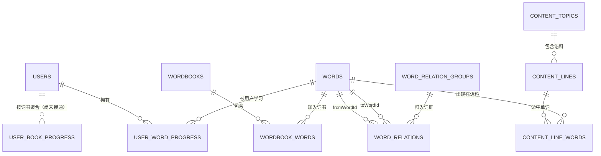

# 当前项目数据关系与业务流程

> 本文基于 2026-06-22 的项目代码整理。以实际运行逻辑为准，并区分“已实现”“部分实现”和“设计中”。

## 1. 总体结论

当前项目采用“微信云开发数据库 + 小程序本地缓存”的混合架构：

- 微信身份由云函数自动取得 `OPENID`，没有单独的账号密码登录表。
- 词书内容以云端为正式数据源，由 `wordbooks + wordbook_words + words` 三层组成。
- 用户对单词的掌握状态保存在 `user_word_progress`，同一个词跨词书共享一条进度。
- 学习页先写本地 `wx.storage`，再异步写云端，保证操作反馈和弱网可用性。
- 复习计划由 `nextReviewAt` 驱动，云端从 `user_word_progress` 查询到期单词。
- 词群由 `word_relation_groups + word_relations` 组成，与词书、主题语料相互独立。
- 主题例句由 `content_topics + content_lines + content_line_words` 组成。
- `user_book_progress`、云端每日选词和云端连续打卡目前尚未完整接通。

## 2. 数据关系总图



可以把它理解为：

```text
词库 words
  ├─ 通过 wordbook_words 组成不同词书
  ├─ 通过 word_relations 形成词群
  ├─ 通过 content_line_words 连接真实语料
  └─ 通过 user_word_progress 连接用户学习状态
```

## 3. 集合职责与当前状态

| 集合 | 作用 | 当前状态 |
|---|---|---|
| `users` | 用户资料、引导状态、当前词书、学习目标、兴趣偏好 | 已使用 |
| `words` | 全局单词实体、音标、释义、音频信息 | 已使用 |
| `wordbooks` | 词书元信息，如 IELTS、CET4 | 已使用 |
| `wordbook_words` | 词书与单词的多对多关系，保存顺序、章节、重点标记 | 已使用 |
| `user_word_progress` | 用户对某个全局单词的学习、复习、收藏和忽略状态 | 已使用，核心进度表 |
| `user_book_progress` | 某用户在某本词书中的聚合统计 | 只在注销时删除，尚未读写维护 |
| `word_relation_groups` | 一个完整词群，如近义词组、易混词组 | 已使用 |
| `word_relations` | 词与词之间的有向关系 | 已使用 |
| `content_topics` | Valorant、视频、影视剧等语料主题 | 已使用 |
| `content_lines` | 主题下的台词、例句、音频和出处 | 已使用 |
| `content_line_words` | 语料句子与单词的命中关系 | 已使用 |
| `word_visuals` | 每日单词视觉内容 | 已使用，但不属于主学习关系 |
| `study_sessions` / `study_events` | 学习会话和逐题行为日志 | 未创建、未使用 |
| `app_config` | 数据源开关和灰度配置 | 设计中，当前代码未读取 |

## 4. 登录与用户同步

### 4.1 登录方式

项目没有传统的“用户名 + 密码”登录。小程序调用云函数时，微信云开发通过 `cloud.getWXContext()` 提供当前用户的 `OPENID`。

```text
小程序启动
  -> wx.cloud.init()
  -> 调用 user-sync
  -> 云函数取得 OPENID
  -> users.doc(OPENID)
```

`users._id` 直接使用 `OPENID`。第一次访问时，`user-sync` 自动创建默认资料；后续访问直接返回已有资料。

### 4.2 首屏与本地缓存

启动时优先读取本地：

- `onboarded`
- `onboarding.wordbook`
- `onboarding.purpose`
- `onboarding.interests`
- `settings.nickname`
- `settings.dailyGoal`

如果本地已有词书，先进入应用，再后台读取 `users` 刷新缓存；如果本地没有，则读取云端 `users.activeBookId`。两边都没有时进入 onboarding。

选择或切换词书时同时写：

```text
本地 onboarding.wordbook
云端 users.activeBookId
```

所以当前是“本地负责快速启动，云端负责跨设备恢复”的结构。

## 5. 词库、词书与词群

### 5.1 词库：`words`

`words` 是全局单词主表，一个规范化单词只保存一份：

```text
word_accurate
  word / normalized
  phonetic
  senses
  audio / audioPolicy
```

单词不直接属于某一本词书，也不把词书顺序放在这里。

### 5.2 词书：`wordbooks + wordbook_words`

`wordbooks` 只保存词书自身信息，例如名称、分类、封面、总词数和版本。

`wordbook_words` 是关系表：

```text
_id = bookId + ":" + wordId
bookId -> wordbooks._id
wordId -> words._id
```

它保存只在某本词书内有意义的属性：

- `order`：本书中的顺序
- `chapter`：章节
- `important`：是否为本书重点词
- `bookSenseOverride`：本书专属释义，非空时覆盖 `words.senses`

因此一个单词可以同时出现在 IELTS、CET4 等多本词书中，但正文只在 `words` 保存一次。

读取一本词书时，`wordbook-fetch` 先分页查 `wordbook_words`，再批量查 `words`，最后在云函数中 join 后返回前端。

### 5.3 词群：`word_relation_groups + word_relations`

词群不是词书章节，而是单词之间的语义关系网络。

`word_relation_groups` 保存组级信息：标题、成员、整体辨析维度、来源和发布状态。

`word_relations` 保存成对关系：

```text
fromWordId -> words._id
toWordId   -> words._id
groupId    -> word_relation_groups._id
relationType = synonym / near_synonym / antonym / confusing / contrast / related
```

单词详情页进入“近义词 / 反义词 / 易混淆”标签时，调用 `wordbook-fetch.relations`，按 `fromWordId + status=published` 查询关系，再补充对应词群。

### 5.4 主题语料不是词书

主题语料使用：

```text
content_topics -> content_lines -> content_line_words -> words
```

例如 Valorant 台词属于 `content_topics/content_lines`；“Valorant 高频词书”如果存在，则属于 `wordbooks/wordbook_words`。两者不能混为同一套数据。

## 6. 每日学习流程

当前每日学习的选词逻辑主要在小程序端完成，云函数的 `learn-submit.today` 目前只返回空数组。

实际流程：

```text
读取当前词书
  -> 合并本地和云端 user_word_progress
  -> 读取今日目标 dailyGoal
  -> 复用 today.{bookId}.{上海日期} 的今日词单
  -> 不足时分页读取 wordbook_words + words
  -> 优先选择未出现过的新词
  -> 新词不足时选择尚未 mastered 的词
  -> 构建选择题并开始学习
```

今日词单保存在本地：

```text
today.{bookId}.{YYYY-MM-DD}
```

这样同一天重新打开学习页时会尽量复用同一批词。

答对时，该词计入今日完成；答错时不会计入，并在当前队列延后约 3 题重新出现，最多重试 2 次。

## 7. 复习逻辑

复习使用 `user_word_progress.nextReviewAt` 判断是否到期：

```text
userId = 当前 OPENID
nextReviewAt <= 当前时间
status != mastered
status != ignored
order by nextReviewAt asc
```

云函数查到进度后，再按 `wordId` 批量读取 `words` 返回单词内容。

当前间隔规则：

| 结果 | 状态 | 下次复习 |
|---|---|---|
| 第一次连续答对 | `reviewing` | 1 天后 |
| 第二次连续答对 | `reviewing` | 3 天后 |
| 第三次连续答对 | `reviewing` | 7 天后 |
| 第四次连续答对 | `reviewing` | 15 天后 |
| 第五次及以后连续答对 | `mastered` | 30 天后，但 mastered 不再进入复习队列 |
| 第一次答错 | `learning` | 不生成短期时间型复习点，保留原 `nextReviewAt` |
| 累计第二次答错 | `learning` | 不生成短期时间型复习点，保留原 `nextReviewAt` |
| 累计第三次及以后答错 | `difficult` | 不生成短期时间型复习点，保留原 `nextReviewAt` |

注意：答错判断使用累计 `wrongCount`，不是连续答错次数；答对不会清零 `wrongCount`。答错词由当前学习 session 负责插回后续队列，答错时不增加今日完成数，例如 10/30 时第 11 个词答错，页面仍显示 10/30，直到该词达到今日通过条件才变为 11/30。

跨天时，昨天未完成的 daily session 不直接恢复页面状态，但其中未通过的词会优先补入今天队列。今天队列总量使用用户设置的每日目标 `settings.dailyGoal`，例如目标为 30 且昨天剩 8 个未完成，则今天优先学习这 8 个，再补 22 个到期复习词或新词。

## 8. 学习进度保存

### 8.1 本地保存

每本词书有一份本地缓存：

```text
progress.{bookId}
```

键是 `normalized` 单词，值包含：

- `wordId`
- `status`
- `interval / nextReviewAt`
- `correctCount / wrongCount / streakCorrect`
- `lastResult`
- `favorite / ignoredAt`
- `dailyDoneDateKey`
- `clientUpdatedAt`

用户答题后先同步写本地，因此页面不需要等待网络。

### 8.2 云端保存

随后前端异步调用 `learn-submit.submit`，写入：

```text
user_word_progress._id = OPENID + ":" + wordId
```

云端不会直接相信客户端算出的次数和间隔，而是读取旧记录后，根据本次 `known/unknown` 重新计算 SRS 状态。

`clientUpdatedAt` 用于幂等与冲突判断：旧提交不会覆盖更新的记录。同一时间、同一结果的重复提交也会跳过。

### 8.3 本地与云端合并

首页和学习页最多每 5 分钟拉取一次全部 `user_word_progress`。同一个词发生冲突时，保留 `clientUpdatedAt/updatedAt` 较新的版本，再写回当前词书的本地缓存。

云端进度按 `wordId` 全局共享：用户在 IELTS 学过 `accurate`，切到其他包含该词的词书时，可以继承这条掌握状态。`bookIds` 记录该进度关联过哪些词书。

### 8.4 收藏与忽略

收藏、忽略不走答题更新，而是调用 `learn-submit.updateWordState`：

- 收藏：更新 `favorite/favoritedAt`
- 删除学习项：写 `status=ignored` 和 `ignoredAt`
- 恢复：清空 `ignoredAt`，按历史答对次数恢复为 `reviewing` 或 `new`

## 9. 当前未闭环部分

### 9.1 `user_book_progress` 未维护

代码目前没有在学习提交后更新 `user_book_progress`，首页的已学数、今日完成数和待复习数都是由本地合并后的 `progress.{bookId}` 动态统计。

因此该表现在只是设计预留；`user-sync.deleteAccountData` 注销时会尝试删除它，但没有正常写入路径。

### 9.2 云端每日选词未实现

`learn-submit.today` 当前固定返回空数组。设计文档中“到期复习优先、错题补充、新词填满”的云端组合逻辑尚未落地，现阶段每日学习由客户端挑选新词。

### 9.3 学习会话与逐题日志未保存

没有 `study_sessions` 或 `study_events` 写入，所以目前只能知道单词最终累计状态，不能完整回答：

- 用户某次学习持续多久
- 一次学习做了哪些题
- 每道题使用了什么题型和选项
- 某天完成了几轮学习

虽然前端提交了部分 `questionType/questionId`，云端当前没有将它们保存到事件表。

### 9.4 连续打卡仅保存在本地

`streakDays` 和 `lastCheckInDate` 当前写入 `wx.storage`，没有同步更新 `users.stats`。而且每次完成一个学习队列都会直接 `streak + 1`，尚未严格按自然日去重。

### 9.5 当前词书存在双写

当前词书同时存在于：

```text
本地 onboarding.wordbook
云端 users.activeBookId
```

正常切换时两者一起更新，但弱网下云端更新失败会暂时不一致。启动逻辑通常优先使用本地值，再后台刷新云端资料。

## 10. 关键代码位置

| 业务 | 文件 |
|---|---|
| 微信身份与用户资料 | `cloudfunctions/user-sync/index.js` |
| 词书、单词、词群查询 | `cloudfunctions/wordbook-fetch/index.js` |
| 复习查询和进度写入 | `cloudfunctions/learn-submit/index.js` |
| 主题语料查询 | `cloudfunctions/topic-fetch/index.js` |
| 启动与用户资料缓存 | `miniprogram/app.js` |
| 学习/复习页面逻辑 | `miniprogram/pages/learn/index.js` |
| 本地与云端进度合并 | `miniprogram/utils/progress-store.js` |
| 词书云端加载与缓存 | `miniprogram/utils/wordbook-loader.js` |
| 单词详情与词群展示 | `miniprogram/pages/word-detail/index.js` |

## 11. 推荐的下一步

按优先级建议：

1. 将每日选词统一迁到 `learn-submit.today`，避免不同设备产生不同今日词单。
2. 在云端事务或可重算任务中维护 `user_book_progress`，首页优先读聚合表。
3. 新增 `study_sessions/study_events`，补齐学习行为分析和可靠打卡。
4. 将连续打卡按上海自然日放到云端计算，修复同日重复累加。
5. 明确 `users.activeBookId` 为权威值，并增加本地待同步队列处理弱网双写失败。
